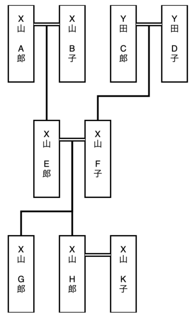

===========
Family Tree
===========

Simple tool to generate family tree diagram.

Setup
=====

Requirements:

* Python 3.6+

Installation:

.. code-block:: bash

   $ pip install git+https://github.com/t-hanya/family-tree.git

Usage
=====

First, please prepare family data in CSV format. Please refer to the sample data in data directory.

`data/sample.csv`:

.. code-block:: text

   id,family_name,first_name,gender,father_id,mother_id,birth_order,spouse_id
    1,        X山,       A郎,     M,         ,         ,           ,        2
    2,        X山,       B子,     F,         ,         ,           ,        1
    3,        Y田,       C郎,     M,         ,         ,           ,        4
    4,        Y田,       D子,     F,         ,         ,           ,        3
    5,        X山,       E郎,     M,        1,        2,          1,        6
    6,        X山,       F子,     F,        3,        4,          1,        5
    7,        X山,       G郎,     M,        5,        6,          1,
    8,        X山,       H郎,     M,        5,        6,          2,       11
    9,        Z川,       I郎,     M,         ,         ,           ,       10
   10,        Z川,       J子,     F,         ,         ,           ,        9
   11,        X山,       K子,     F,        9,       10,          2,        8
   12,        Z川,       L子,     F,        9,       10,          1,

Then, please run the `familytree` command to generate family tree diagrams.

.. code-block:: bash

   $ familytree path/to/your/data.csv

HTML documents including family tree will be created in `output` directory.

LICENSE
=======

Released under the MIT license.

